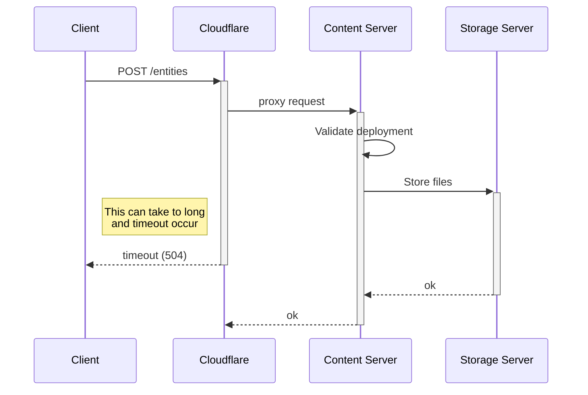
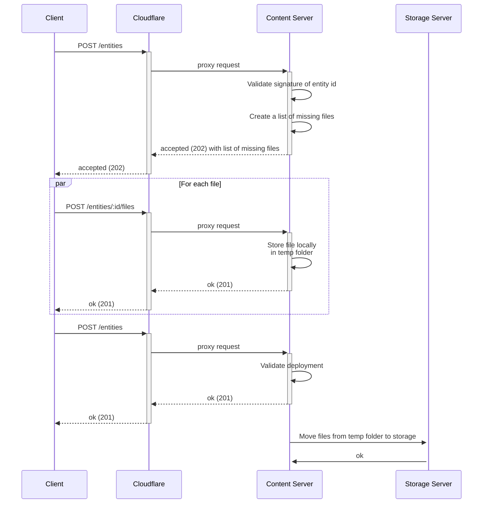

# Decentraland Entity Deployment Protocol

## Introduction

The deployment protocol is used for sending entities to the Content Server. The protocol is very simple and is designed to deploy one entity at a time. To accomplish that, it sends a multipart/form-data POST request to the Content Server including:

* The entity's content (its metadata).
* The entity id.
* All the files.
* The auth-chain signing the entity id.

This approach is quite simple, but it has some issues. For e.g., when deploying a big scene, it requires sending all the files in a single request. A scene can have many files and potentially contain 250 Mb.

First of all, all requests are proxied by Cloudflare. Then, depending on the type of storage used by the Content Server, it may require those uploaded files to be forwarded to a different storage system (like AWS S3). This new upload can only take place after all the files have been received, and makes the overall time to deploy a scene longer, potentially causing a timeout on the Cloudflare side.

## Proposal
A new approach is proposed to solve this issue. The idea is to split the deployment process into multiple steps:
* Initiate a deployment request.
* Upload all content files in parallel.
* Finalize the deployment by submitting only the entity.

